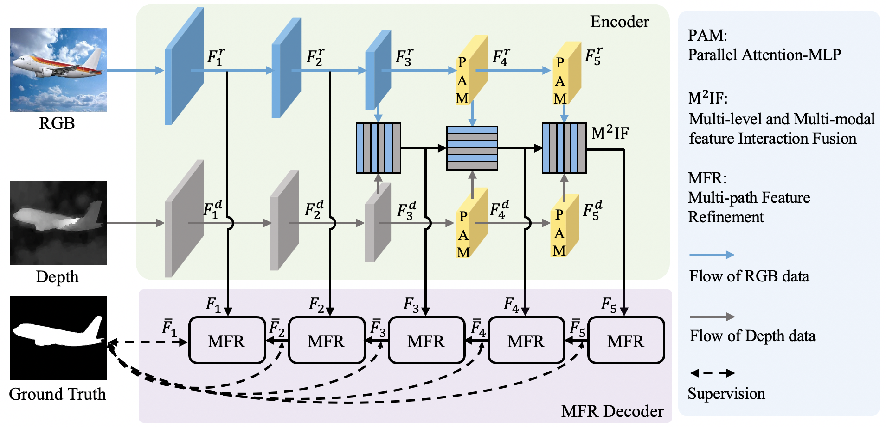

# AirSOD: A Lightweight Network for RGB-D Salient Object Detection

  

# Acknowledgements
We thank but not limited to following repositories for providing assistance for our research:
- [MobileSal](https://github.com/yuhuan-wu/MobileSal)
- [criss-cross](https://github.com/speedinghzl/CCNet)
